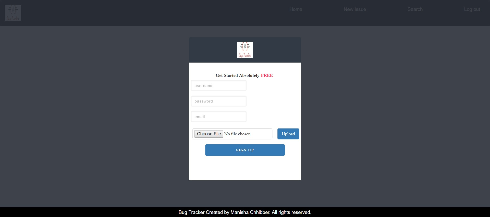
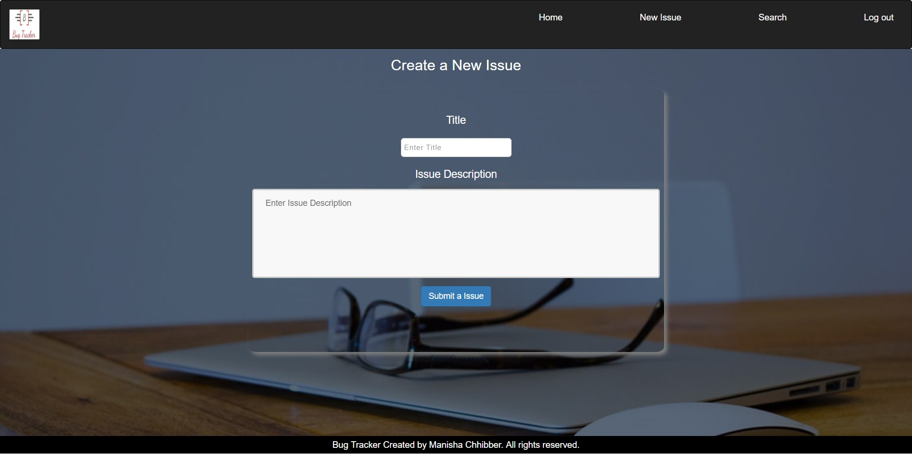
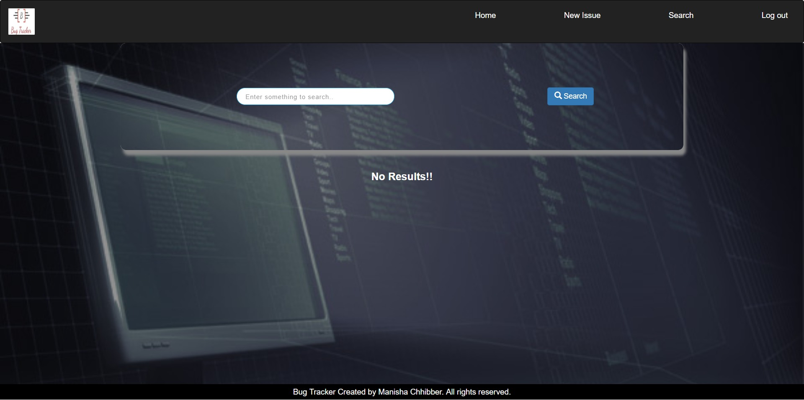

# BugTracker

## About
Bug Tracker is a full stack web application that helps users to manage bugs. This application allows for creating a new bug, post comment on bugs and search bugs by username or bug description. BugTracker has admin login which has access to all users and bug details  It also allow managers(admin) to keep track of bugs and user and see different reports. Admin can see different reports in graphical form and send email to multiple users at the same time.
BugTracker was a personally developed application.

## Technologies
- React
- Node
- Redux- Redux is a predictable state container for JavaScript apps.
- Express - webframework used for created robust APIs
- Massive - Data access tool for the Postgres database
- axios - promise library for ajax calls
- chart.js - I use to show charting of user's transactions
- Styled Components- styled-components allows you to write actual CSS code to style your components.
- express-session - used for session management
- NodeMailer- Nodemailer is a module for Node.js applications to make sending emails very simple.
- AWS S3 Storage
- PostgreSQL - database
- Cloudinary - a API to store images on cloud
- Jest - Unit testing
- Postman - Endpoint testing
- Cypress - End to end testing

## Hosting info
- Hosted on an digital ocean
- Using ngynx as it's reverse proxy
- PM2 to help with node server management

## Additional Info
- BugTracker was designed using the MVC pattern
- Authentication is handled by bcrypt

## Screenshots

### -Dashboard

### -Signup

### -Home

### -List of issues/bugs

### -Create new Issue

### -Search

